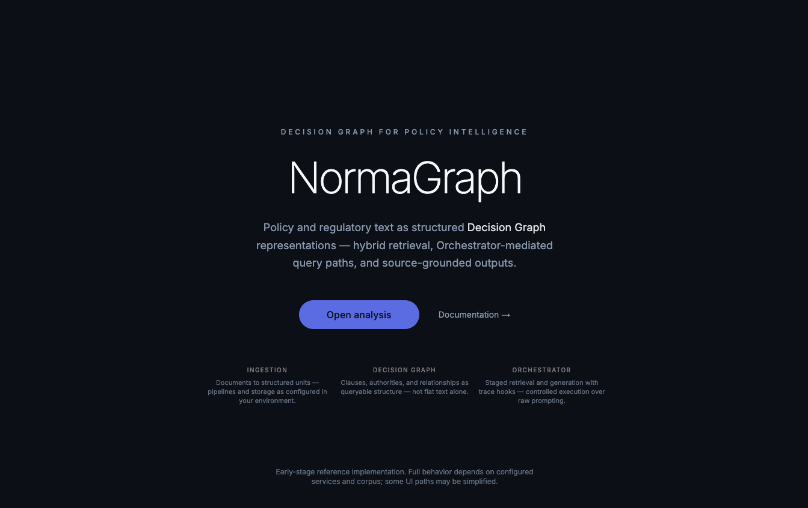
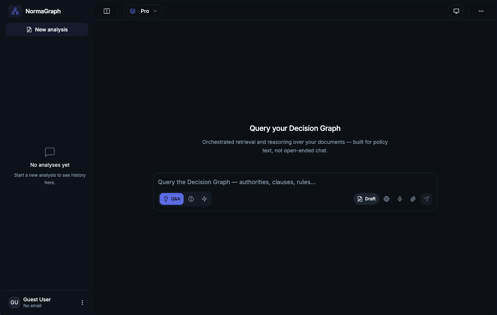
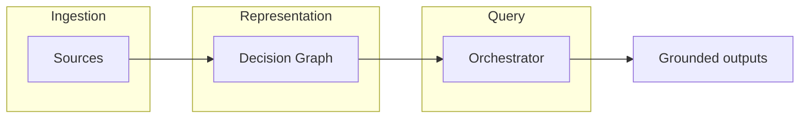

# NormaGraph

> **Decision Graph for Policy Intelligence**

NormaGraph is a domain-aware intelligence system that transforms policy and regulatory documents into **Decision Graph representations**.

The system is designed with a clear separation between **ingestion**, **representation (Decision Graph)**, and **query orchestration**.

By constructing a **Decision Graph** over document content — clauses, authorities, relationships — it enables precise, explainable querying beyond traditional flat-text retrieval.

### Screenshots

**Landing page** — hero with ingestion, Decision Graph, and Orchestrator pillars.



**Query workspace** — orchestrated retrieval UI (sidebar, analysis history, query input).



---

## Why NormaGraph?

Most retrieval stacks treat documents as **unstructured text**. NormaGraph treats them as **systems of rules**.

The **Decision Graph** is the named idea: a structured view of clauses, authorities, and relationships that supports:

- Structured reasoning over policy text (not only similarity search)
- **Deterministic retrieval paths** where the pipeline enforces controlled selection
- **Explainable outputs** with traceable grounding (citations, traces, risk signals where implemented)

NormaGraph operates as a **reasoning-oriented system** rather than a chat interface over documents.

---

## Design principles

- **Deterministic retrieval** over unconstrained guessing where the **Orchestrator** applies it
- **Structured representations** over treating documents as a single blob of text
- **Explainability** as a first-class concern (traces, citations, observable stages)

## System characteristics

- Hybrid retrieval (semantic + structured / metadata)
- Source-grounded responses when the corpus and services are configured
- Instrumented query pipeline (logging and trace hooks in the backend)

NormaGraph **separates retrieval from reasoning**, enabling controlled query execution rather than unconstrained generation over raw context.

### Decision Graph (overview)



---

## Scope & status

NormaGraph is an **early-stage applied AI system** — a **reference implementation** of domain-aware retrieval and structured reasoning over policy documents.

- Some integrations (e.g. authentication, optional API helpers) are **stubbed or simplified** in the frontend (`frontend/lib/firebase.ts`, parts of `frontend/lib/api.ts`).
- **Full functionality** requires external infrastructure: e.g. **Google Cloud** (BigQuery, Vertex/Gemini, GCS as configured), **Qdrant**, and valid credentials / API keys.
- The system is **not production-hardened** (operational monitoring, SLAs, full auth, data governance) — it is intended to demonstrate **architecture and engineering choices** clearly.

⚠️ **Never commit real API keys.** Copy `.env.example` to `.env` locally; keep secrets out of git.

---

## Repository structure

| Path | Purpose |
|------|---------|
| **`backend/`** | FastAPI **standard API**, ingestion, hybrid retrieval, answering, risk/citations. Run from repo root: `python -m backend` (see `backend/__main__.py`). |
| **`normagraph_core/`** | **Decision Graph** construction and **Orchestrator** (streaming / ADK-oriented API) — integrates with `backend.query` when services are available. |
| **`frontend/`** | Next.js UI for analysis and interaction. |
| **`data/`** | Optional document inventory / metadata for your corpus (see `data/DATA.md`). |
| **`requirements.txt`** (root) | Installs **backend** + **normagraph_core** Python dependencies in one step. |
| **`pyproject.toml`** (root) | Editable install (`pip install -e .`) and the **`normagraph-api`** CLI entry point. |
| **`docs/`** | Design notes — e.g. [`docs/runtime_profiles.md`](./docs/runtime_profiles.md) (cloud / local / hybrid execution model). |

---

## Install vs run

- **`pip install -e .`** — Development workflow and **CLI** (`normagraph-api`): installs the `normagraph` package in editable mode from `pyproject.toml`.
- **`pip install -r requirements.txt`** — Simple environment setup without an editable package install (same dependency pins via nested `requirements` files).

Use either pattern; align with how you want imports and the console script to behave.

---

## API (standard backend, port 8000)

Illustrative surface of `backend.api.main` — interactive docs: **`GET /docs`** (Swagger) when the server is running.

| Method | Path | Purpose |
|--------|------|---------|
| `GET` | `/health` | **Liveness** — API up; **Orchestrator** initializes; component readiness flags |
| `GET` | `/status` | **Service metadata** — version and advertised routes (lightweight; not a full dependency matrix) |
| `POST` | `/query` | Query the corpus / Decision Graph–backed pipeline |
| `POST` | `/query/stream` | Streaming query response |

### Health check

**URL:** `http://localhost:8000/health`  
(Port follows `PORT` in `.env`, default `8000`.)

---

## Run modes

Run from the **repository root** unless noted.

### Backend (standard API)

The backend can be started using Python module execution (`python -m backend`), ensuring correct import resolution without modifying `PYTHONPATH`.

```bash
python -m venv .venv
source .venv/bin/activate   # Windows: .venv\Scripts\activate
pip install -r requirements.txt   # or: pip install -r backend/requirements.txt
python -m backend
```

**Alternative (direct uvicorn):**

```bash
uvicorn backend.api.main:app --host 0.0.0.0 --port 8000 --reload
```

**CLI (same process as `python -m backend`, after editable install):**

```bash
pip install -e .
normagraph-api
```

### Streaming API (Decision Graph Orchestrator)

```bash
pip install -r requirements.txt   # installs backend + normagraph_core
uvicorn normagraph_core.api.main:app --host 0.0.0.0 --port 8001 --reload
```

Use another port if `8000` / `8001` is taken. Point the frontend at the API you run via `NEXT_PUBLIC_API_URL`.

### Frontend

```bash
cd frontend
npm install
cp ../.env.example .env.local   # optional
npm run dev
```

Open `http://localhost:3000`. The PDF viewer loads the PDF.js worker from **unpkg** (see `frontend/components/PdfViewer/index.tsx`).

---

## Environment

```bash
cp .env.example .env
```

Edit `.env` with your GCP project, credentials path, `QDRANT_URL`, and model keys as required by your deployment. Variables are grouped in `.env.example`.

---

## Example (illustrative)

**Query:** *Who is responsible for approving budget reallocations?*

| Field | Example |
|--------|---------|
| Authority | Finance Committee |
| Clause | Section 4.2 |
| Source | Policy Document A |
| Confidence | High (when returned by the backend) |

**Intent:** Routed through the **Orchestrator** and **Decision Graph**–oriented retrieval — not a single unconstrained completion. Real answers depend on your indexed corpus and services.

---

## Testing

- **Unit / integration tests** under `normagraph_core/tests/` often require **GCP**, **Qdrant**, and credentials; many cases **skip** when services are missing.
- **CI** (`.github/workflows/ci.yml`) runs **`pip install -e .`**, an **import check** (`import backend, normagraph_core`), **Python `compileall`** on `backend` and `normagraph_core`, and **frontend** `lint`, `type-check`, and `build` — it does **not** run full integration tests against live cloud services.

```bash
pip install -r requirements.txt pytest
pytest normagraph_core/tests/ -q
```

---

## Scripts

| Command | Purpose |
|---------|---------|
| `python -m backend` | Standard API from repo root (`python -m` resolves `backend` as a package) |
| `normagraph-api` | Same as above, via `pip install -e .` console script (`pyproject.toml`) |
| `cd frontend && npm run build` | Production build |
| `cd frontend && npm run lint` | ESLint |

---

## Version

**0.1.0**  
Defined in [`pyproject.toml`](./pyproject.toml) and [`VERSION`](./VERSION).

---

## License

MIT — see [LICENSE](./LICENSE).
